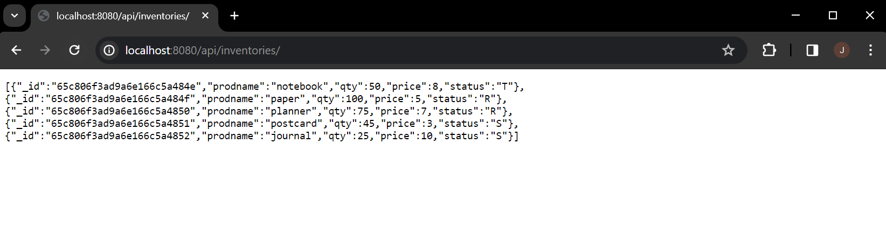
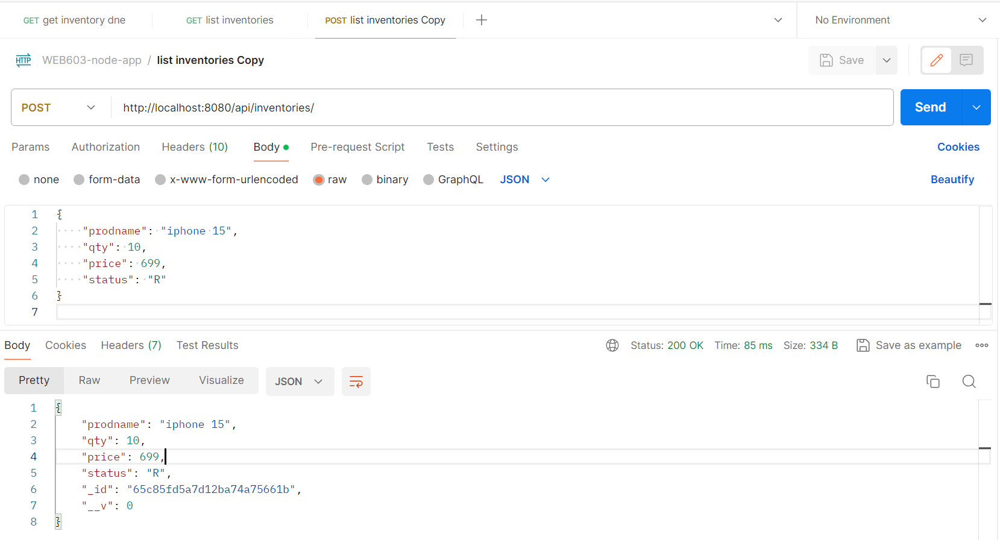
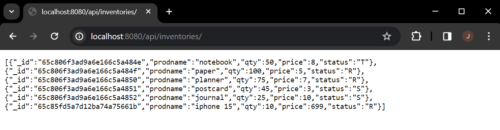
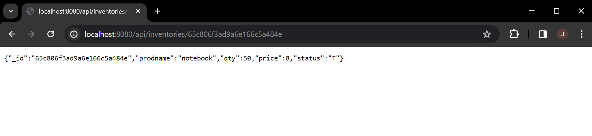
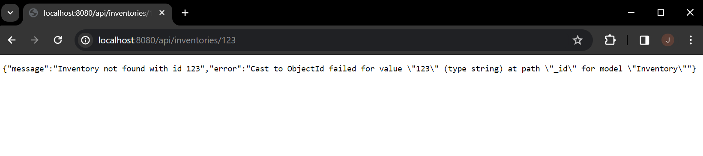
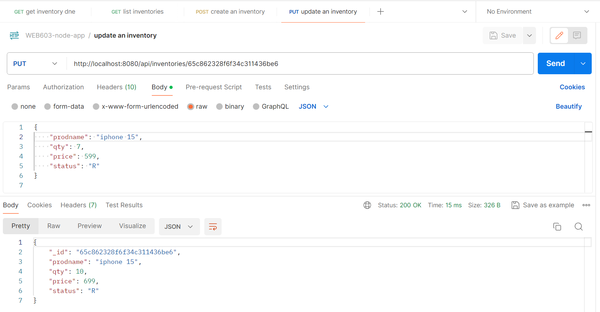
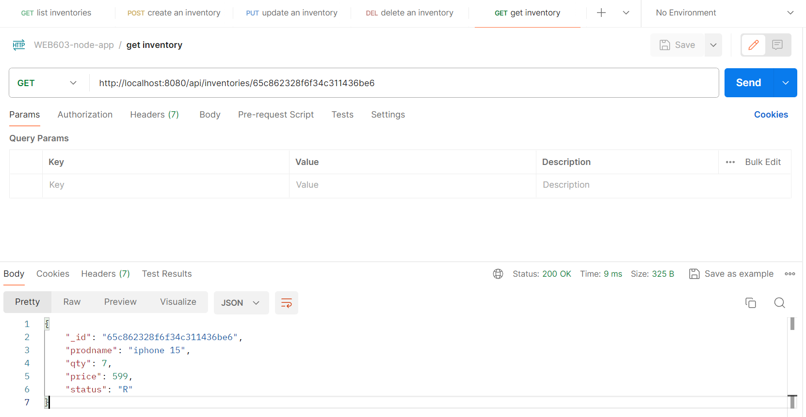
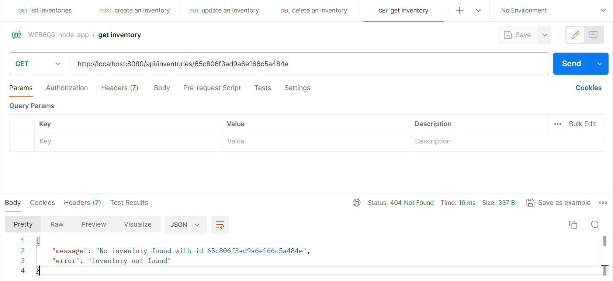

# web603-hw-w5d1

## Getting Started

### Step 1: Connecting to MongoDB and Mongo Compass

Follow the instruction to install MongoDB and Mongo Compass, and you should be able to run

```bash
$ mongod
```
to start MongoDB as a daemon process and (in another terminal)
```bash
$ mongo
```
to drop into a Mongo shell, where you can use MongoDB commands to do read / write operations.


**With `/.../web603-hw-w5d1/` being the current directory and `mongod` running**, drop the starting data `inventories.json` and import it into MongoDB by running the follwing command:
```bash
$ mongoimport --db react-crud --collection inventories --drop --file inventories.json
```
The above commands means that:
- the database to be created will be called "react-crud".
- the collection to be created inside the database will be called "inventories".
- the path to the data file to be imported is `inventories.json`.

If successful, you should be seeing success messages.
```
2024-02-10T15:29:55.187-0800    connected to: mongodb://localhost/
2024-02-10T15:29:55.187-0800    dropping: react-crud.inventories
2024-02-10T15:29:55.219-0800    5 document(s) imported successfully. 0 document(s) failed to import.
```

For visualization, use Mongo Compass to connect to your local MongoDB instance, that is, connecting to `localhost:27017`. If everything above works out perfectly, you should be seeing the database "react-crud" created, the collection "inventories" created, and 5 pieces of data displayed.


#### *If you are using WSL (run a Linux environment as a subsystem in Windows), you will need extra configuration and troubleshooting to get started.*

For personal reference:

```bash
# set up local database
$ sudo mkdir -p data/db

# grant permissions
$ sudo chown -R `id -un` data/db

# grab your WSL2 IP address to let Mongo Compass connect to "WSL2 localhost"
$ ip addr | grep eth0

# start mongod but telling it to accept all incoming IP address
# - This does poses a risk if you don't set up security measures in Mongo Compass.
# - Alternative, you can make this change in `/etc/mongod.conf`, but I don't recommend.
$ mongod --bind_ip 0.0.0.0
```

### Step 2: Create Express App and Install Dependencies

Create folders and files based on the instruction.

***If you are using WSL, adjust the database host defined in `.env` accordingly.***

Then with the project root `node-mongo/` as the current directory, run

```bash
$ npm init
```
to initialize the application in Express JS framework.

Regarding dependencies, only the following ones need to be installed:
```bash
$ npm intall express mongoose cors body-parser dotenv
```

## Test All Endpoints

If everything works correctly, running the app by `npm start` at project root.

For GET endpoints, you can easily test them in a browser. For POST, PUT, and DELETE methods, you can test them using `curl` or Postman.

***Make sure to test all endpoints!***

Try to cover as many cases as possible, as there might be typo, bugs, or deprecated APIs. And see if the response is desired. For example, in case of retrieving, updating, or deleting an inventory by id, think about if it is better to return `null` (response 200) or to raise DNE error (response 404) for each use case.

### List Inventories
```
GET /api/inventories/
```


### Create An Inventory
```
POST /api/inventories/
```


List inventories after creating an inventory.



### Get Inventory By Id
```
GET /api/inventories/:id
```

Inventory exists:



Inventory does not exist:



### Update An Inventory
```
PUT /api/inventories/:id
```

(The response body shows the data before update. The code was written to so as to return such data, and it could be improved. In fact, the update did happen in the database.)



### Delete An Inventory
```
DELETE /api/inventories/:id
```


Get the inventory after delete.

